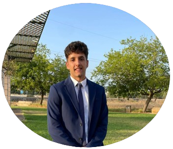

<div style="position: relative;">
  
  
</div>


### Hi, I'm Luis 👋🧑‍💻
[](https://github.com/luisgrana2)
[](https://www.linkedin.com/in/luis-granados-segura-099290222/)
[](mailto:lgsgranados@gmail.com)
<p><em>Robotics Engineer at </em> <a href="https://www.upc.edu/es">BarcelonaTech University</a> 

## About me in Code:

```python
const luisgrana2 = {
  code: [Python, C++, Arduino, ROS, ROS2, HTML, CSS],
  interests: [Robotics, Computer Vision,
              SLAM, Automatic Control]
  challenge: "Finishing my master's thesis in Enhancing
              Modeling and Motion Analysis for Industrial
              Pastry Dough Quality"
}
```
<div>
  
  
</div>
