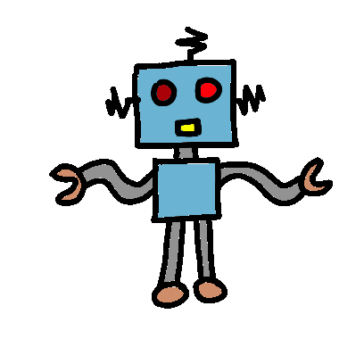

### Hi, I'm Luis ‍👋🧑‍💻


[](https://github.com/luisgrana2)
[](https://www.linkedin.com/in/luis-granados-segura-099290222/)
[](mailto:lgsgranados@gmail.com)

<p><em>Robotics Engineer at </em> <a href="https://www.upc.edu/es">BarcelonaTech University</a> 
<p><em>Working at </em> <a href="https://www.dronomy.es/">Dronomy</a>


## About me in Code:

```javascript
const luisgrana2 = {
  code: ["Python", "C++", "Arduino", "ROS", "ROS2", "MATLAB", "HTML", "CSS"],
  interests: ["Robotics", "Computer Vision", "SLAM", "Automatic Control"],
  challenge: "My current challenge is to develop innovative robotics projects using ROS2."
}
```
  
  

